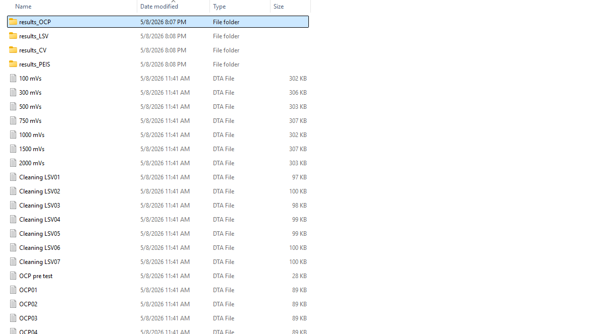
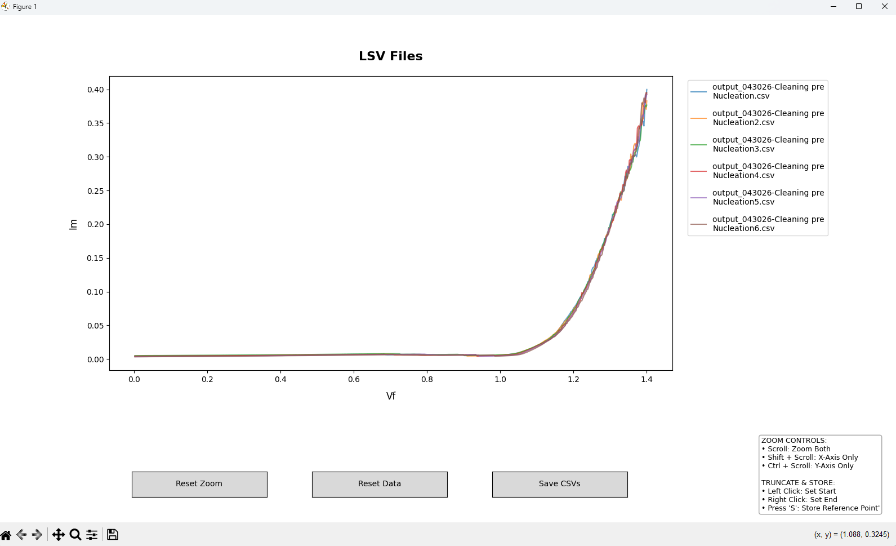
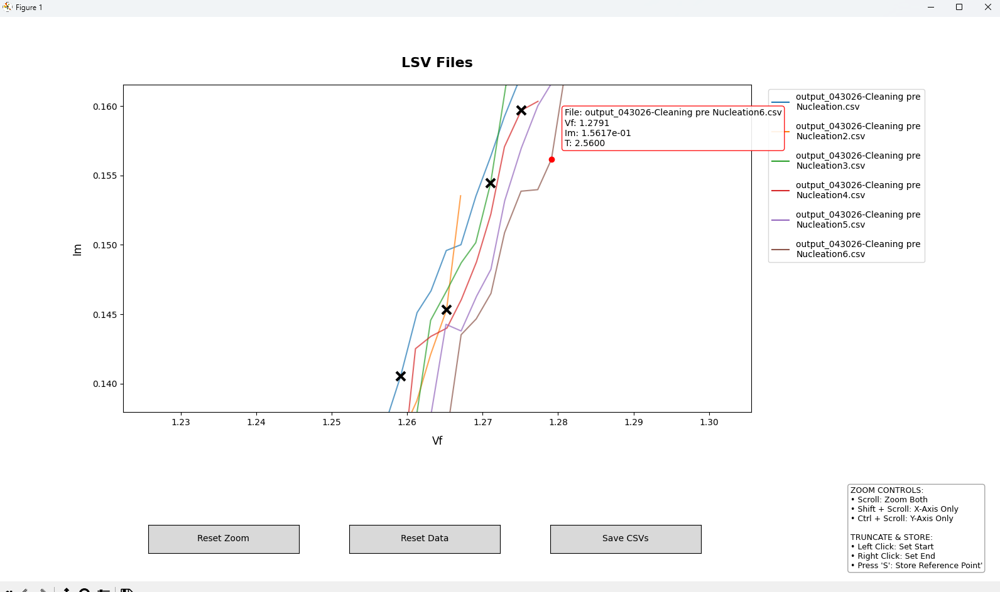
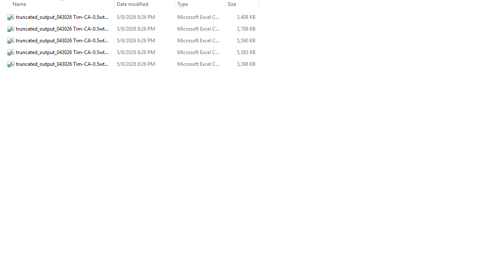

# Gamry Electrochemical Data Suite

#Paser Preview


#Truncator Preview




A complete Python-based workflow for processing, visualizing, and truncating electrochemical data. This suite transforms raw Gamry `.dta` files into clean datasets and provides an interactive GUI for precise data slicing.
Made for researchers at Argonne National Lab

## 📋 Table of Contents
- [Workflow Overview](#-workflow-overview)
- [Installation](#-installation)
- [Part 1: DTA Parser (The Converter)](#part-1-dta-parser-the-converter)
- [Part 2: Interactive Truncator (The Workbench)](#part-2-interactive-truncator-the-workbench)
- [Controls Guide](#-controls-guide)
- [Metadata & Exports](#-metadata--exports)

---

## 🔄 Workflow Overview

1. **Extraction:** The `Parser` scans `.dta` files, extracts raw curves, and identifies experiment types (CV, CA, LSV, etc.).
2. **Organization:** Files are sorted into tagged folders (e.g., `results_CV/`) with metadata injected into the headers.
3. **Refinement:** The `Truncator` GUI loads these CSVs, allowing you to visually trim data and store specific reference points.
4. **Final Export:** High-resolution truncated files are saved with a full audit trail of the original parameters.

---

## 🛠️ Installation

### Prerequisites
- Python 3.8+
- [Git](https://git-scm.com)

### Setup
```bash
# Clone the repository
git clone https://github.com
cd gamry-data-suite

# Install dependencies
pip install pandas numpy matplotlib gamry-parser
```

---

## Part 1: DTA Parser (The Converter)

The parser handles the "messy" work of reading Gamry's proprietary format and converting it into structured tables using an in-memory SQL engine.

**To Run:**
Place your `.dta` files in the root folder and run:
```bash
python dta_parser.py
```

- **Supported Experiments:** CV, LSV, CA, CC, OCP, PEIS.
- **Smart Logic:** Automatically finds missing parameters like `QLIMIT` by scanning raw text lines.

---

## Part 2: Interactive Truncator (The Workbench)

The Truncator is a high-performance GUI built on Matplotlib for manual data cleaning. It uses a **two-stage snapping algorithm** to ensure clicks align with real data points.

**To Run:**
```bash
python multi_plot_truncator.py
```

### 🖱️ Controls Guide


| Action | Command |
| :--- | :--- |
| **Zoom Both Axes** | Scroll Wheel |
| **Zoom X-Axis Only** | `Shift` + Scroll |
| **Zoom Y-Axis Only** | `Ctrl` + Scroll |
| **Pan / Move** | `Left Click` + Drag |
| **Set Start Point** | `Left Click` (Snaps to point) |
| **Set End Point** | `Right Click` (Snaps to point) |
| **Store Reference Point** | Hover + Press `S` |
| **Toggle Series** | Click Legend Icon |

---

## 💾 Metadata & Exports

Exported CSVs from the Truncator include specialized `#` headers. These headers are ignored by Pandas' `read_csv(comment='#')` but remain human-readable in Excel.

**Included Metadata:**
- Original Filename
- Truncation Index Range
- Physical Range (e.g., Voltage Start/End)
- Stored Reference Point coordinates

---

## 📦 Building Standalone Executables

To share this tool with colleagues who do not have Python installed:
```bash
pip install pyinstaller
pyinstaller --noconsole --onefile --icon=app_icon.ico multi_plot_truncator.py
```

## ⚖️ License
Distributed under the MIT License.
